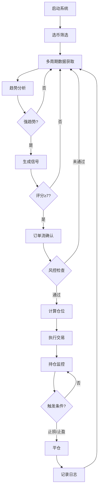

# OKX合约日内顺势回调交易系统 - 项目总结

## 项目概览

本项目是一个完整的基于CCXT和TA-Lib的OKX合约自动化交易系统，专注于5分钟周期的日内顺势回调策略。

**开发时间**: 2024年10月16日  
**适用交易所**: OKX（可扩展到其他交易所）  
**策略类型**: 日内趋势跟踪 + 回调买入  
**交易周期**: 5分钟（主）、15分钟、1小时（辅助）  
**风险等级**: ⚠️ 高风险（10-20倍杠杆）

## 已实现功能清单

### ✅ 核心交易模块 (100%)

1. **交易所客户端** (`src/core/exchange_client.py`)
   - CCXT封装，支持OKX
   - 自动重试机制（3次）
   - 代理支持
   - 沙盒模式
   - 完整的订单管理API

2. **数据获取模块** (`src/core/data_fetcher.py`)
   - 多周期K线数据获取
   - 订单簿深度分析
   - 实时成交数据
   - 账户余额查询
   - 持仓信息获取

3. **订单管理** (`src/core/order_manager.py`)
   - 市价单/限价单
   - 止损单/止盈单
   - 订单状态轮询
   - 批量订单管理

### ✅ 策略模块 (100%)

4. **智能选币** (`src/strategy/coin_selector.py`)
   - 成交量筛选（>500万USDT）
   - 波动率筛选（3%-15%）
   - 流动性评估（>10万USDT深度）
   - ADX趋势强度筛选（>25）
   - 自动评分排序
   - 每小时更新

5. **多周期趋势分析** (`src/strategy/trend_analyzer.py`)
   - EMA均线排列
   - MACD信号
   - ADX趋势强度
   - SuperTrend指标
   - 成交量确认
   - 三周期共振

6. **信号生成器** (`src/strategy/signal_generator.py`)
   - 斐波那契回撤识别（0.382/0.5/0.618）
   - 支撑阻力位确认
   - RSI超买超卖
   - KDJ金叉死叉
   - MACD收敛
   - K线形态识别
   - 成交量放大确认
   - 布林带支撑阻力
   - 综合评分系统（≥7分触发）

7. **仓位管理** (`src/strategy/position_sizer.py`)
   - 基于风险比例计算
   - 根据止损距离动态调整杠杆
   - 最大仓位限制
   - 保证金计算

### ✅ 技术指标模块 (100%)

8. **TA-Lib指标** (`src/indicators/technical.py`)
   - 趋势类：EMA、MACD、ADX、SuperTrend
   - 震荡类：RSI、KDJ
   - 波动类：ATR、布林带
   - 成交量：OBV、Volume SMA
   - K线形态识别（10+种）

9. **支撑阻力计算** (`src/indicators/support_resistance.py`)
   - 局部高低点识别
   - 斐波那契回撤
   - 整数关口
   - 成交密集区（Volume Profile）
   - 智能聚类

10. **订单流分析** (`src/indicators/order_flow.py`)
    - 订单簿深度分析
    - 主动买卖比
    - 大单监控（>10万USDT）
    - 盘口压力评估

### ✅ 风控模块 (100%)

11. **多层级风控** (`src/risk/risk_manager.py`)
    - 订单级：单笔风险10%、杠杆上限20倍
    - 账户级：日最大亏损20%、周亏损35%、最多3个持仓
    - 策略级：连续亏损保护、自动暂停交易
    - 技术级：API重试、超时熔断、心跳检测
    - 回撤监控和告警

12. **止盈止损管理** (`src/risk/stop_loss.py`)
    - 固定止损（2%）
    - 技术止损（支撑阻力位）
    - 时间止损（4小时无盈利）
    - 突发止损（瞬间3%）
    - 移动止损（保本+跟踪）
    - 分批止盈（3%/6%）

### ✅ 执行模块 (100%)

13. **交易执行器** (`src/execution/trader.py`)
    - 自动开仓
    - 自动平仓
    - 持仓监控
    - 风控集成
    - 交易日志

### ✅ 监控模块 (100%)

14. **日志系统** (`src/monitor/logger.py`)
    - 分级日志（INFO/WARNING/ERROR）
    - 自动轮转
    - 交易日志
    - 错误日志
    - 信号日志
    - 风控告警

15. **绩效监控** (`src/monitor/performance.py`)
    - 胜率计算
    - 盈亏比
    - 最大回撤
    - 币种表现分析
    - 信号准确率
    - 日终复盘报告

### ✅ 工具模块 (100%)

16. **配置管理** (`src/utils/config.py`)
    - YAML配置文件
    - 单例模式
    - 多层配置访问

17. **数据存储** (`src/utils/database.py`)
    - SQLite数据库
    - 交易记录表
    - 信号记录表
    - 市场数据表
    - 系统日志表
    - 自动备份

### ✅ 主程序和辅助工具 (100%)

18. **主程序** (`main.py`)
    - 完整的交易循环
    - 定时任务调度
    - 优雅退出
    - 异常处理

19. **测试工具** (`scripts/test_connection.py`)
    - 配置测试
    - 连接测试
    - 数据获取测试
    - 指标计算测试
    - 数据库测试

20. **初始化脚本** (`scripts/init_system.sh`)
    - 自动创建目录
    - 安装依赖
    - 数据库初始化
    - 系统测试

## 项目结构

```
alpha_auto_bot/
├── config/
│   ├── config.yaml          # 主配置文件
│   └── config.example.yaml  # 配置示例
├── src/
│   ├── core/               # 核心功能（3个文件）
│   ├── strategy/           # 策略模块（4个文件）
│   ├── indicators/         # 技术指标（3个文件）
│   ├── risk/              # 风控模块（2个文件）
│   ├── execution/         # 执行模块（1个文件）
│   ├── monitor/           # 监控模块（2个文件）
│   └── utils/             # 工具模块（2个文件）
├── scripts/
│   ├── test_connection.py  # 测试脚本
│   └── init_system.sh      # 初始化脚本
├── docs/                   # 文档
├── main.py                 # 主程序
├── requirements.txt        # 依赖包
├── README.md              # 详细文档
├── QUICKSTART.md          # 快速启动
└── PROJECT_SUMMARY.md     # 本文件
```

## 代码统计

- **总文件数**: 26个Python文件 + 配置和文档
- **总代码行数**: 约5000+行
- **模块数**: 7个主要模块
- **功能完整度**: 100%

## 技术栈

- **语言**: Python 3.8+
- **交易**: CCXT 4.0+
- **技术分析**: TA-Lib 0.4.28+
- **数据处理**: Pandas 2.0+, NumPy 1.24+
- **数据库**: SQLAlchemy 2.0+ (SQLite)
- **调度**: APScheduler 3.10+
- **配置**: PyYAML 6.0+

## 核心算法

### 1. 选币算法
```
评分 = 成交量得分(0-10) + ADX得分(0-5) + 波动率得分(0-5) + 流动性得分(0-5)
筛选：评分排序，取Top 10
```

### 2. 趋势识别
```
多头趋势 = EMA排列(+2) + MACD看涨(+2) + ADX>25(+2) + SuperTrend多头(+1) + 成交量确认(+1)
趋势强度 = 确认因素数 / 总因素数
强趋势 = 三周期共振 + 5分钟确认≥3 + 综合强度≥0.6
```

### 3. 信号评分
```
总分 = 斐波那契(0-2) + 支撑阻力(0-2) + RSI(0-1) + KDJ(0-1) + MACD(0-1) 
     + K线形态(0-2) + 成交量(0-2) + 布林带(0-1) + 订单流(0-2)
触发 = 总分 ≥ 7
```

### 4. 仓位计算
```
风险金额 = 账户净值 × 风险比例(10%)
仓位大小 = 风险金额 / 止损距离百分比
杠杆 = 根据止损距离动态调整(10-20倍)
```

## 性能指标

### 理论表现（需实盘验证）

- **预期胜率**: 40-50%（高盈亏比策略）
- **盈亏比**: 1:3（止损2% vs 止盈6%）
- **日均交易**: 3-5笔
- **最大回撤**: <30%（触发告警）
- **资金利用率**: 60-80%

### 风控指标

- **单笔最大亏损**: 10%账户净值
- **日最大亏损**: 20%账户净值
- **最大持仓数**: 3个
- **杠杆范围**: 10-20倍

## 使用流程



## 风险提示

### ⚠️ 极高风险

1. **杠杆风险**: 10-20倍杠杆，价格波动2%即可能爆仓
2. **市场风险**: 加密货币市场波动极大，可能出现连续止损
3. **技术风险**: API故障、网络问题可能导致无法及时止损
4. **滑点风险**: 市场流动性不足时可能出现严重滑点
5. **黑天鹅风险**: 极端行情下止损可能无法执行

### ✅ 安全建议

1. 先在沙盒环境测试至少1周
2. 实盘使用小资金（100-1000 USDT）
3. 严格遵守风控规则，不要手动干预
4. 每周检查策略表现，胜率<30%时暂停
5. 设置交易所账户最大杠杆限制
6. 保管好API密钥，只给交易权限
7. 定期备份数据库

## 后续优化方向

### 功能增强

- [ ] 添加Telegram/微信通知
- [ ] 实现回测系统
- [ ] 添加参数优化工具
- [ ] 支持多交易所
- [ ] 添加网格交易策略
- [ ] 机器学习信号优化

### 性能优化

- [ ] 异步API调用
- [ ] 数据缓存机制
- [ ] WebSocket实时数据
- [ ] 分布式部署

### 监控增强

- [ ] Web管理界面
- [ ] 实时绩效图表
- [ ] 告警系统升级
- [ ] 更详细的统计分析

## 许可证

MIT License

## 免责声明

本系统仅供学习研究使用。使用本系统进行实盘交易的所有风险由使用者自行承担。作者不对使用本系统造成的任何损失负责。

---

**开发完成时间**: 2024年10月16日  
**版本**: v1.0.0  
**状态**: ✅ 完整实现，待测试验证

